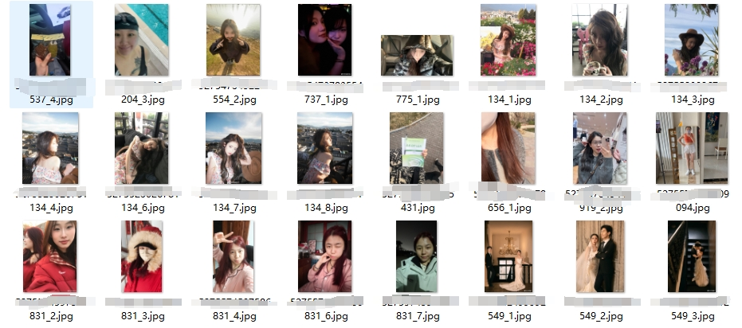

# 微博同城图片筛选项目
Weibo Local Image Filtering Project

[中文说明在前 / English follows below]


# 中文说明

## 1. 项目简介

这个项目源于一个很简单的生活困扰。

刷微博同城的时候发现，每天都有很多漂亮的小姐姐在上面分享日常——街拍、美食、出行、自拍——内容质量挺高的，看着也赏心悦目。但问题是，微博同城的信息流更新很快，今天没刷到的内容明天就被淹没了，而自己又不可能每天都守着微博刷一遍，总感觉会错过什么。

于是就想：**能不能让程序替我每天去刷，把值得看的图片自动筛出来？**

带着这个想法，这个项目慢慢搭建起来了。从最开始只是写了个简单的爬虫抓取同城帖子，到后来加上图片下载、人脸识别过滤，再到最后接入多模态大模型做进一步的细分筛选，整个流程一步步打通，最终实现了全自动的图片采集与筛选pipeline。

核心流程：

1. 抓取微博同城帖子
2. 下载帖子中的图片
3. 用本地模型筛出「人脸图片」
4. 用多模态大模型继续细分，筛出「同城美女的图片」

---

## 2. 项目结构

```text
github_release/
├── main.py
├── pipeline.py
├── SECOND_include-images2.py
├── img_recognization.py
├── img_dir_process.py
├── requirements.txt
├── config.example.json
├── .env.example
├── README.md
├── LICENSE
├── .gitignore
├── classification/
│   ├── README.md
│   ├── face_classifier.py
│   └── prediction.py
├── skill/
│   └── skill.md
├── mcp_stub/
│   └── README.md
└── mcp_server/
    ├── README.md
    └── server.py
```

---

## 3. 推荐配置方式：.env + config.json

### 第一步：复制环境变量模板

```bash
copy .env.example .env
```

### 第二步：复制配置模板

```bash
copy config.example.json config.json
```

### 第三步：填写真实参数

你需要在 `.env` 中填写：

- 微博同城参数
- 微博 Cookie
- 微博 XSRF Token
- 大模型 API Key
- 大模型服务地址
- 运行参数

`config.json` 作为结构模板，真正的敏感值通过环境变量注入。

---

## 4. 如何选择自己的“家乡城市”抓取同城微博

微博同城抓取最关键的是：

- `containerid`
- `luicode`
- `lfid`

推荐做法：

1. 登录微博网页
2. 打开“同城 / 附近”页面
3. 切换到目标城市
4. 打开开发者工具（F12）
5. 在 Network 中搜索：

```text
https://m.weibo.cn/api/container/getIndex
```

6. 将对应请求里的以下参数填入 `.env`：
   - `WEIBO_CONTAINERID`
   - `WEIBO_LUICODE`
   - `WEIBO_LFID`

---

## 5. 运行方式

### 单次运行

```bash
python main.py --pages 3 --interval 0
```

### 定时运行

```bash
python main.py
```

---

## 6. 微博滑块 / 验证码处理

当微博接口触发反爬时，程序会自动启动 Selenium 并打开浏览器。

你需要：

1. 登录微博
2. 手动完成滑块 / 验证码
3. 回到终端按 Enter

程序会自动同步 Cookie 和 XSRF Token，然后继续执行。

---

## 7. GitHub 上传前必须隐藏的信息

- 微博 Cookie
- `x-xsrf-token`
- API Key
- `.env`
- `config.json`
- `chrome_user_data/`
- 运行日志
- 下载图片
- CSV 数据
- 模型权重（如果你不打算公开）

---

## 8. MCP / Skill 支持

本项目已附带：

- `skill/skill.md`：智能体技能说明
- `mcp_stub/README.md`：MCP 拆分设计草案
- `mcp_server/server.py`：最小可运行 MCP Server 示例

---

# English

## 1. Overview

This project is an integrated pipeline for:

1. Crawling **Weibo local/city posts**
2. Downloading post images
3. Filtering face images using a local classifier
4. Further identifying **young women images** using a multimodal LLM

This GitHub release is **sanitized** and ready for open-source publication:

- Real API keys removed
- Real Weibo cookies removed
- Real XSRF tokens removed
- Real runtime data removed

---

## 2. Recommended Configuration: .env + config.json

### Step 1
Copy environment template:

```bash
cp .env.example .env
```

### Step 2
Copy config template:

```bash
cp config.example.json config.json
```

### Step 3
Fill real values into `.env`

Sensitive values should stay in `.env`, while `config.json` keeps the project structure.

---

## 3. How to choose your own city for local Weibo crawling

The most important parameters are:

- `containerid`
- `luicode`
- `lfid`

Recommended approach:

1. Log in to Weibo web/mobile web
2. Open the local/city page
3. Switch to your target city
4. Open browser devtools
5. Find requests to:

```text
https://m.weibo.cn/api/container/getIndex
```

6. Copy the parameters into `.env`

---

## 4. Run

### Run once

```bash
python main.py --pages 3 --interval 0
```

### Run on schedule

```bash
python main.py
```

---

## 5. Verification / slider captcha

If Weibo anti-bot protection is triggered, Selenium will open a browser window.
You need to:

1. Log in to Weibo
2. Solve the slider/captcha manually
3. Return to terminal and press Enter

The program will sync cookies and continue.

---

## 6. Sensitive information you must NOT upload

- Weibo cookies
- `x-xsrf-token`
- API keys
- `.env`
- `config.json`
- `chrome_user_data/`
- logs
- downloaded images
- CSV datasets
- model weights (if not intended for release)

---

## 7. MCP / Skill support

This release already contains:

- `skill/skill.md`
- `mcp_stub/README.md`
- `mcp_server/server.py`

These files make the project easier to integrate into agent workflows.
